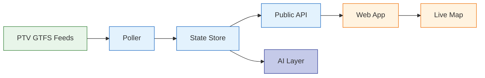

# train-tracker

Close-to-real-time Melbourne metro train tracker built on Victoria's open
GTFS-Realtime feeds: a polling/state service, JSON API + SSE stream, live map,
and an AI layer with clearly-labelled inferences.

> Work in progress. Architecture writeup lands when the project ships.

Design priorities: polite consumption of the upstream public API, security by
construction, deep observability, and data honesty (gaps recorded, staleness
displayed, inferences labelled).

## Architecture



### Data flow

1. **Ingest** — The poller fetches GTFS-Realtime feeds (Vehicle Positions,
   Trip Updates, Service Alerts) on a ~10s cycle with adaptive backoff.
   Static schedule data is pinned per service day.

2. **Merge** — Feeds are decoded and merged into an in-memory state store
   with per-field freshness tracking.

3. **Serve** — The public API exposes merged state as JSON and via an
   SSE stream (snapshot on connect, then incremental deltas).

4. **Consume** — The React frontend on GitHub Pages receives real-time
   updates via SSE, with periodic polling for staleness indicators.

5. **Observe** — Prometheus metrics on every design gate; dashboards
   and alerts for staleness, rate-limit abuse, and error rates.

6. **AI (optional)** — On-demand disruption briefings via a restricted
   endpoint. The LLM reads only local state and every inference is
   clearly labelled.

## Development setup

This repo ships a pre-commit hook (`.githooks/pre-commit`) that blocks
commits containing secrets via [gitleaks](https://github.com/gitleaks/gitleaks)
(`brew install gitleaks` or see their releases page). Git doesn't enable
custom hook directories by default, so after cloning, run once:

```
git config core.hooksPath .githooks
```

CI also runs gitleaks on every push as a backstop, but this local hook is
what stops a secret from being committed in the first place.

## Data attribution

Train positions and schedule data are derived and processed from the
**Victorian Department of Transport and Planning**'s GTFS-Realtime and
static GTFS feeds, published under
[**CC BY 4.0**](https://creativecommons.org/licenses/by/4.0/). This is not
a copy of the original feeds. The same credit is served live at the
deployed API's `/attribution` endpoint; the map frontend (in progress)
will carry a matching visible credit once it ships.
