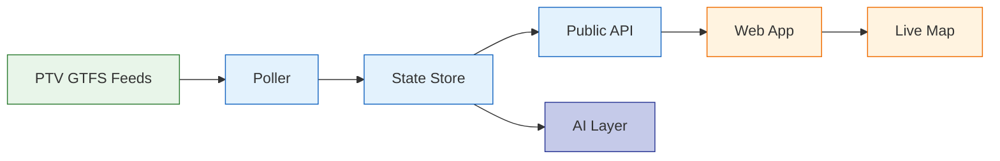

# train-tracker

Close-to-real-time Melbourne metro train tracker built on Victoria's open
GTFS-Realtime feeds: a polling/state service, JSON API + SSE stream, live map,
and an AI layer with clearly-labelled inferences.

> Live and evolving. Core tracking, map, and AI weekly digest are deployed;
> a few AI-layer pieces (see below) are still in progress.

Design priorities: polite consumption of the upstream public API, security by
construction, deep observability, and data honesty (gaps recorded, staleness
displayed, inferences labelled).

## Architecture



### Data flow

1. **Ingest** — The poller fetches GTFS-Realtime feeds (Vehicle Positions,
   Trip Updates, Service Alerts) on a ~10s cycle with adaptive backoff.
   Static schedule data is pinned per service day.

2. **Merge** — Feeds are decoded and merged into an in-memory state store
   with per-field freshness tracking.

3. **Serve** — The public API exposes merged state as JSON and via an
   SSE stream (snapshot on connect, then incremental deltas).

4. **Consume** — The React frontend on GitHub Pages receives real-time
   updates via SSE, with periodic polling for staleness indicators.

5. **Observe** — Prometheus metrics on every design gate; dashboards
   and alerts for staleness, rate-limit abuse, and error rates.

6. **AI (optional)** — A weekly digest (on-time/late/cancelled stats per
   line, narrated by an LLM) is generated automatically and served
   read-only. Disruption briefings are on-demand only, reachable through a
   restricted endpoint with no automatic per-cycle triggering. Both features
   share a hard monthly spend cap and read only local, already-derived
   state — never the raw upstream feed as instructions. Every inference is
   clearly labelled as an inference, not a fact. See the
   [AI system card](docs/system-card.md) for the full accountability
   writeup: scope, known failure modes, monitoring, and eval.

## Features

- **Live map** — real-time train positions via SSE, with an honest
  live → coasting → ghost state machine: trains fall back to their
  last-known or scheduled position when feed coverage drops, and are
  drawn visibly faded (not pulsing) so a ghost position never reads as
  a confirmed one.
- **Station search & schedules** — search by station, view next
  departures with live-vs-scheduled labelling.
- **Service alerts** — active disruptions surfaced in an announcements
  panel.
- **AI weekly digest** — automated, narrated summary of on-time/late/
  cancelled performance per line, generated once a week under a fixed
  budget cap.
- **On-demand AI briefings** — short, evidence-labelled disruption
  summaries, triggered manually rather than automatically.
- **Theme + route/ghost visibility toggles**, and privacy-friendly,
  no-cookie pageview analytics ([GoatCounter](https://www.goatcounter.com/)).

## Development setup

This repo ships a pre-commit hook (`.githooks/pre-commit`) that blocks
commits containing secrets via [gitleaks](https://github.com/gitleaks/gitleaks)
(`brew install gitleaks` or see their releases page). Git doesn't enable
custom hook directories by default, so after cloning, run once:

```
git config core.hooksPath .githooks
```

CI also runs gitleaks on every push as a backstop, but this local hook is
what stops a secret from being committed in the first place.

## Data attribution

Train positions and schedule data are derived and processed from the
**Victorian Department of Transport and Planning**'s GTFS-Realtime and
static GTFS feeds, published under
[**CC BY 4.0**](https://creativecommons.org/licenses/by/4.0/). This is not
a copy of the original feeds. The same credit is served live at the
deployed API's `/attribution` endpoint and carried visibly on the map
frontend.

**Not travel advice.** This is a personal, portfolio project, not an
official source. Positions can lag, be inferred rather than observed
(see the ghost/coasting states above), or be temporarily unavailable.
For real-time trip planning, use PTV's own official app or website.
